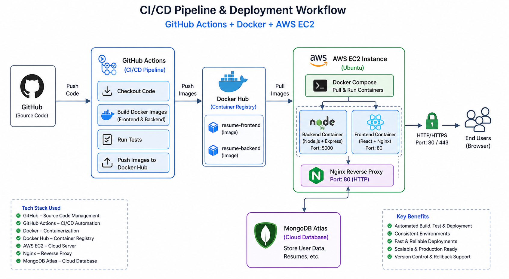

# AI Resume Builder

AI Resume Builder is a full-stack MERN application for creating, editing, improving, previewing, downloading, and sharing professional resumes with AI assistance.

Live Application: http://15.206.192.162/  
Repository: https://github.com/jayesh-patil03/AI_Resume_Builder.git 
Vercel Fallback: https://ai-resume-builder-pi-ten.vercel.app/ 
Docker Hub Frontend Image: `jayeshpatil2512/resume-frontend`  
Docker Hub Backend Image: `jayeshpatil2512/resume-backend`

---

## Project Overview

### What This Project Does

AI Resume Builder helps users create job-ready resumes through a guided web interface. Users can register, log in, build multiple resumes, update individual resume sections, use AI to enhance content, preview different templates, download resumes, and share public resume links.

The application is designed as a complete production-style full-stack project, with a React frontend, Node.js/Express backend, MongoDB Atlas database, AI integration, Docker containerization, and CI/CD deployment on AWS EC2.

### Why This Project Was Built

Creating a professional resume can be time-consuming, especially when users need strong summaries, clean formatting, and reusable templates. This project solves that by combining a simple resume builder UI with AI-powered content enhancement.

From an engineering point of view, the project also demonstrates a real deployment workflow:

- Full-stack MERN application development
- Secure authentication with JWT
- Cloud database integration with MongoDB Atlas
- AI feature integration using Gemini API
- Docker-based containerization
- Automated CI/CD with GitHub Actions
- Production deployment on AWS EC2

### How It Works

The frontend provides the resume builder interface, template previews, authentication pages, dashboard, and form-based resume editing experience. It communicates with the backend through Axios API calls.

The backend exposes REST APIs for authentication, resume management, AI enhancement, and image upload support. It validates protected routes with JWT middleware, stores user and resume data in MongoDB Atlas, and uses external services such as Gemini API and ImageKit where required.

In production, the frontend and backend are built into Docker images. GitHub Actions automatically builds those images, pushes them to Docker Hub, connects to the AWS EC2 instance, pulls the latest images, and restarts the running containers.

---

## Features

- User registration and login
- JWT-based authentication
- Protected backend API routes
- Create and manage multiple resumes
- Edit resume sections independently
- AI-powered resume content improvement
- Multiple resume templates
- Live resume preview
- Resume PDF download
- Public shareable resume links
- Profile and image upload support
- Responsive frontend design
- Dockerized frontend and backend
- CI/CD deployment with GitHub Actions
- AWS EC2 production hosting

---

## Tech Stack

### Frontend

- React 19
- Vite
- Redux Toolkit
- React Router
- Axios
- Tailwind CSS
- Lucide React
- React Hot Toast

### Backend

- Node.js
- Express.js
- MongoDB Atlas
- Mongoose
- JSON Web Token
- Bcrypt
- Multer
- ImageKit

### AI Integration

- Google Gemini API
- `@google/genai`

### DevOps and Deployment

- Docker
- Docker Hub
- GitHub Actions
- AWS EC2
- Ubuntu server
- Nginx container for frontend serving
- MongoDB Atlas cloud database

---

## Folder Structure

```text
AI_Resume_Builder/
|
|-- .github/
|   `-- workflows/
|       `-- deploy.yml
|
|-- client/
|   |-- public/
|   |-- src/
|   |   |-- app/
|   |   |-- assets/
|   |   |-- components/
|   |   |   |-- home/
|   |   |   `-- templates/
|   |   |-- configs/
|   |   |-- pages/
|   |   |-- App.jsx
|   |   `-- main.jsx
|   |-- Dockerfile
|   |-- package.json
|   `-- vite.config.js
|
|-- server/
|   |-- configs/
|   |-- controllers/
|   |-- middlewares/
|   |-- models/
|   |-- routes/
|   |-- Dockerfile
|   |-- package.json
|   `-- server.js
|
|-- docs/
|   `-- deployment-workflow.png
|
|-- docker-compose.yml
|-- .gitignore
`-- README.md
```

---

## Local Development Setup

### 1. Clone the Repository

```bash
git clone https://github.com/jayesh-patil03/AI_Resume_Builder.git
cd AI_Resume_Builder
```

### 2. Backend Setup

```bash
cd server
npm install
```

Create a `.env` file inside the `server/` directory:

```env
PORT=3000
MONGODB_URI=your_mongodb_connection_string
JWT_SECRET=your_jwt_secret
GEMINI_API_KEY=your_gemini_api_key
GEMINI_MODEL=your_gemini_model
IMAGEKIT_PUBLIC_KEY=your_imagekit_public_key
IMAGEKIT_PRIVATE_KEY=your_imagekit_private_key
IMAGEKIT_URL_ENDPOINT=your_imagekit_url_endpoint
```

Run the backend:

```bash
npm run server
```

The backend will run on:

```text
http://localhost:3000
```

### 3. Frontend Setup

Open a new terminal:

```bash
cd client
npm install
```

Create a `.env` file inside the `client/` directory:

```env
VITE_BASE_URL=http://localhost:3000
```

Run the frontend:

```bash
npm run dev
```

The frontend will run on the Vite development URL shown in the terminal, usually:

```text
http://localhost:5173
```

---

## Run with Docker Compose

The project includes Dockerfiles for both frontend and backend, plus a root `docker-compose.yml`.

```bash
docker compose up --build
```

Default container ports:

- Backend: `http://localhost:3000`
- Frontend: `http://localhost:5173`

The backend uses environment variables from `server/.env`.

---

## Use Prebuilt Docker Images

The frontend and backend images are available on Docker Hub, so anyone can create containers from the images without worrying about local Node.js versions, dependency installation, build steps, or machine-specific setup.

Docker Hub images:

```bash
docker pull jayeshpatil2512/resume-frontend:tagname
docker pull jayeshpatil2512/resume-backend:tagname
```

Run the backend container:

```bash
docker run -d \
  --name resume-backend \
  -p 5000:3000 \
  --env-file ./server/.env \
  jayeshpatil2512/resume-backend:tagname
```

Run the frontend container:

```bash
docker run -d \
  --name resume-frontend \
  -p 8080:80 \
  jayeshpatil2512/resume-frontend:tagname
```

After running both containers:

- Frontend container: `http://localhost:8080`
- Backend container: `http://localhost:5000`

Replace `tagname` with the image tag you want to use, such as `latest`, a version tag, or a CI/CD generated tag.

Push commands used for Docker Hub publishing:

```bash
docker push jayeshpatil2512/resume-frontend:tagname
docker push jayeshpatil2512/resume-backend:tagname
```

This makes the deployment repeatable on any server that has Docker installed.

---

## Deployment

This project is deployed on an AWS EC2 Ubuntu instance using Docker and GitHub Actions. The main goal of the deployment setup is to make every production update repeatable, automated, and independent of manual server configuration.



### Production Workflow

1. Developer pushes code to the `main` branch on GitHub.
2. GitHub Actions starts the CI/CD workflow.
3. The workflow checks out the source code.
4. Docker builds separate images for the frontend and backend.
5. The images are pushed to Docker Hub:
   - `jayeshpatil2512/resume-frontend`
   - `jayeshpatil2512/resume-backend`
6. GitHub Actions connects to the AWS EC2 instance using SSH secrets.
7. EC2 pulls the latest Docker images from Docker Hub.
8. Old containers are stopped and removed.
9. New frontend and backend containers are started.
10. End users access the live application through the EC2 public URL.

### GitHub Actions Secrets

The CI/CD pipeline uses repository secrets for secure deployment:

- `DOCKER_USERNAME`
- `DOCKER_PASSWORD`
- `EC2_HOST`
- `EC2_USER`
- `EC2_SSH_KEY`

These secrets allow GitHub Actions to log in to Docker Hub and securely deploy the latest containers to the EC2 instance.

### Production Container Ports

The current deployment workflow runs containers with these mappings:

```text
Backend container:  EC2 port 5000 -> Container port 3000
Frontend container: EC2 port 8080 -> Container port 80
```

The live application is available at:

```text
http://15.206.192.162/
```

---

## API Overview

The backend exposes REST APIs under these route groups:

```text
/api/users     Authentication and user operations
/api/resumes   Resume CRUD and resume sharing
/api/ai        AI-powered resume content enhancement
```

Root health check:

```text
GET /
Response: SERVER IS LIVE ...
```

---

## Authentication

- Passwords are hashed before storage using bcrypt.
- JWT is used for secure user sessions.
- Protected routes are handled through backend authentication middleware.
- The frontend stores and sends the token for authenticated requests.

---

## Key Benefits

- Complete full-stack resume builder project
- AI-enhanced resume writing workflow
- Clean separation between frontend and backend
- Docker images make setup simple and consistent
- CI/CD pipeline reduces manual deployment work
- AWS EC2 deployment demonstrates production hosting
- MongoDB Atlas keeps database hosting cloud-ready
- Docker Hub images can be reused on any Docker-supported machine

---

## Author

Jayesh Patil  
LinkedIn: http://www.linkedin.com/in/jayesh-patil2512  
Email: jayeshpat9422@gamil.com
